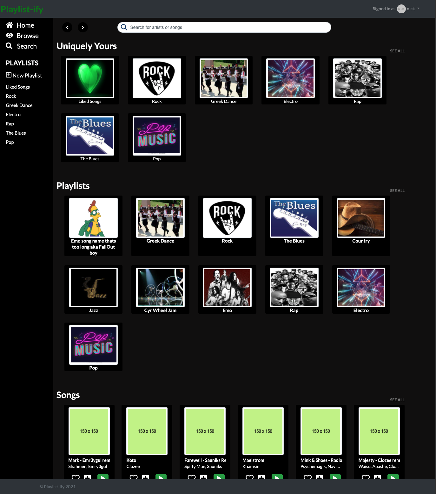

# Playlistify

  

    <h5>Landing Page</h5>
    
  

  

    <h5>Browsing Homepage (not logged in)</h5>
    
  

  

    <h5>User Profile homepage</h5>
    
  

  

    <h5>Example Playlist and menus</h5>
    
  

  

    <h5>Browsing Page (logged in)</h5>
    
  

Based off the Express framework of YelpCamp, this full-stack project is intended as a Spotify clone with limited capabilities, focusing on recreating the frontend of the Spotify web player instead of a backend.   

Direct link to app: https://playlistify-express.herokuapp.com/

### Technologies used:

-MEN stack

-MongoDB (Database)

-Express.js (Server framework)

-Node.js (Javascript environment)

-Bootstrap 4 (Front-end framework)

-Heroku (Hosting platform)
˜
-HTML

-CSS

-Javascript

## Getting Started

### Installing
If you would like to run the application locally, please ensure that you have the prerequisites installed, then take the following steps:
- Clone this repository to your local machine with `git clone <repo-url>`.
- Install NPM dependencies by running `npm install` in the project directory.
- Ensure that you are in the root project directory, then run `nodemon`.
- The application will be running at `localhost:3000/`

## Author
Nicholas Karsant
## License
This project is licensed under the MIT License - see the [LICENSE](LICENSE.md) file for details.