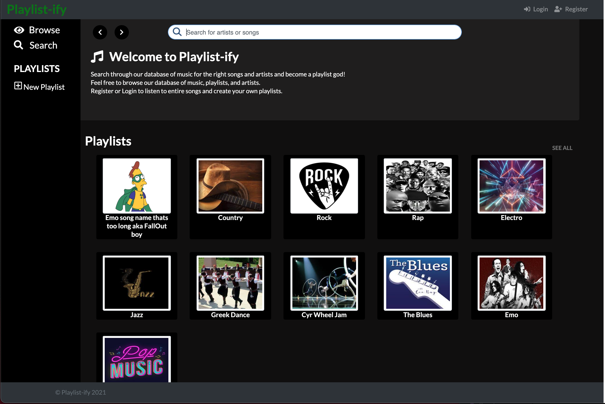
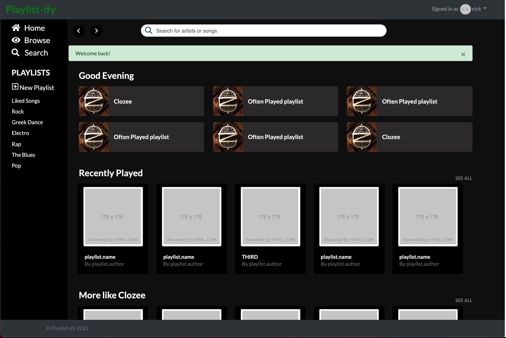
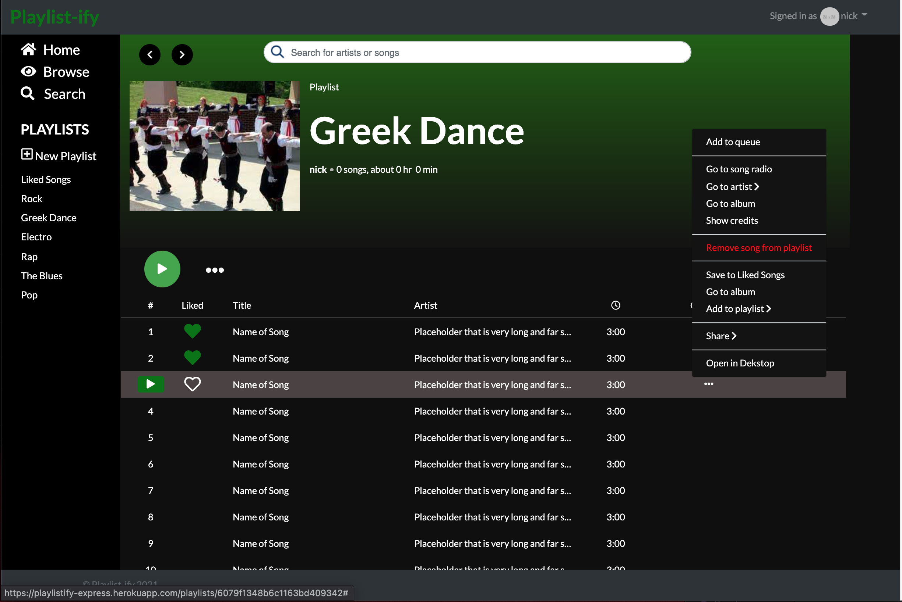

# Playlistify

A simple static multi-page website for a small business offering acrobatic and prop manipulation classes.  

Direct link to app:

### Technologies used:

Bootstrap 4 (Front-end framework)

Cards, Modal

Express.js (Server framework)

Heroku (Cloud platform)

MongoDB 

Node.js (Javascript environment)

## Getting Started

### Installing
If you would like the view the site from a user's point of view, you have the option of viewing the site on Heroku. It is located at <"coming soon">.
 
If you would like to run the application locally, please ensure that you have the prerequisites installed, then take the following steps:
- Clone this repository to your local machine with `git clone <repo-url>`.
- Install NPM dependencies by running `npm install` in the project directory.
- If you use a MySQL username other than `root` or have a MySQL password, open `config/config.json` and update these values on lines 3 and 4.

- Ensure that you are in the root project directory, then run `npm start`.
- The application will be running at `localhost:3000/`

## Author
Nicholas Karsant
## License
This project is licensed under the MIT License - see the [LICENSE](LICENSE.md) file for details.